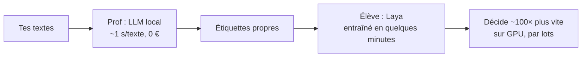

# Laya, du « 100× plus rapide » viral à ce qui rapporte vraiment

> Retour d'expérience mesuré sur [Laya](https://github.com/NandhaKishorM/laya), un petit modèle de décision open-source : comment on a vérifié la promesse, comment on l'a installé, entraîné et rendu rentable, et surtout ce que ce test nous a fait construire autour.


## En 30 secondes

| | |
| --- | --- |
| **La promesse** | « 100× plus rapide que le cloud » |
| **La réalité, sans entraînement** | À peine mieux que le hasard (0,36 contre 0,32) |
| **Après entraînement sur nos données** | **×96 de débit** face au modèle local qu'il imite, pour 14 à 21 points de justesse en moins |
| **Quand c'est rentable** | Trier des centaines de milliers d'éléments d'un coup, ou pré-filtrer un flux |
| **Ce qui a rapporté le plus** | Pas Laya lui-même : la recherche hybride locale (+21 %), le routeur d'outils (6 % → 63 %), la mesure systématique |

## Sommaire

1. [Décortiquer la démo avant d'y croire](#1-décortiquer-la-démo-avant-dy-croire)
2. [Installation](#2-installation)
3. [Le rendre rentable : la méthode « prof → élève »](#3-le-rendre-rentable--la-méthode--prof--élève-)
4. [Ce qui n'a PAS marché](#4-ce-qui-na-pas-marché-pour-vous-éviter-de-le-refaire)
5. [Monter en puissance : graphe du code + recherche hybride](#5-monter-en-puissance--graphe-du-code--recherche-hybride)
6. [Ce qui a rentabilisé BEAUCOUP plus que le modèle](#6-ce-qui-a-rentabilisé-beaucoup-plus-que-le-modèle)
7. [Comment on travaille aujourd'hui](#7-comment-on-travaille-aujourdhui)
8. [Reproduire](#8-reproduire)

---

## 1. Décortiquer la démo avant d'y croire

[Laya](https://github.com/NandhaKishorM/laya) est un petit modèle open-source de 421 M de paramètres. Ce n'est **pas un LLM** : c'est un classifieur. Il ne génère pas de texte, il répond en une seule passe à des questions typées : un choix parmi des options, un score, un oui/non avec une probabilité.

La vidéo virale le montre « 100× plus rapide que le cloud ». En creusant :

| Ce que la démo dit | Ce qu'on a vérifié |
| --- | --- |
| 100× plus rapide | La démo compare un modèle **local** à un **aller-retour réseau** vers une API cloud. Elle mesure surtout le réseau. Face à un autre modèle local, l'écart tombait à **2 à 5×**. |
| 0,766 de justesse | Ce score vient d'un checkpoint **entraîné sur le jeu d'entraînement du benchmark lui-même**. Sans entraînement (zero-shot) : **0,362, contre 0,318 au hasard**. |
| Bon en modération | Sur des données jamais vues : **0,53**, ça ne tient pas. |
| Multilingue | En français : **0,54 à 0,59** sur 20 options, soit environ 4 erreurs sur 10. |
| Comparé au concurrent cloud | Le README de l'auteur précise que les chiffres du concurrent **n'ont jamais été mesurés par lui**. Ils sont repris de billets de blog. |

> **Règle qu'on en tire** : avant de croire un écart annoncé, cherche **qui a mesuré les deux côtés**. Ici, personne. Chaque maillon (article → README → vidéo de 30 s) perd une réserve en route.

À l'honneur de l'auteur : son README a une section « Limits, stated plainly » qui dit tout ça. Ce n'est pas le modèle qui est du marketing, c'est l'emballage autour.

**Conclusion à ce stade** : sans entraînement, Laya ne sert à rien. Toute la valeur est dans l'entraînement sur **tes propres données**. Donc on l'a entraîné.

---

## 2. Installation

Testé sous Windows 11 et Python 3.13, avec une carte graphique NVIDIA récente (génération Blackwell, RTX 50xx) et un CPU 16 cœurs.

```bash
python -m venv .venv
# Windows : .venv\Scripts\activate    Linux/Mac : source .venv/bin/activate

# PyTorch AVANT Laya. Les RTX 50xx exigent une build CUDA 12.8 (cu128) :
# les builds plus anciennes ne reconnaissent pas la carte.
pip install torch --index-url https://download.pytorch.org/whl/cu128
# Sans carte NVIDIA :  pip install torch

pip install -r requirements.txt
```

Vérification rapide :

```python
import laya, time
agent = laya.load("convaiinnovations/laya-multilingual")   # multilingue : le checkpoint anglais est faible en français
q = {"spam": {"type": "noul", "instructions": "Ce message est-il du spam ?"}}
agent.predict("Gagne 1000 € en cliquant ici", q)            # 1er appel = chargement
t = time.perf_counter(); print(agent.predict("Réunion demain 10h", q)); print((time.perf_counter() - t) * 1000, "ms")
```

Mesuré chez nous : **21 à 37 ms** par décision sur le GPU, **environ 50 ms sur le CPU seul** (8 fils). Pas besoin de GPU pour le faire tourner en permanence. (Pour info : pas de NPU sur les Ryzen de bureau, c'est réservé aux puces mobiles.)

Le « prof » (étape suivante) tourne avec [Ollama](https://ollama.com) :

```bash
ollama pull qwen2.5:14b    # le prof
ollama pull bge-m3         # embeddings pour la recherche hybride (§5)
```

---

## 3. Le rendre rentable : la méthode « prof → élève »

Le problème de tout le monde : pour entraîner Laya, il faut **des milliers d'exemples étiquetés**. Personne n'a envie de les écrire à la main.

La solution : **un LLM local plus gros étiquette gratuitement, Laya apprend à l'imiter.**



Notre cas réel : un pipeline qui transforme des **contenus vidéo** en fiches de veille. Il en avait produit environ 13 700. Le prof (qwen2.5:14b) les notait déjà une par une : catégorie et niveau d'intérêt.

1. **Nettoyage** : on jette toutes les réponses illisibles du prof, **sans jamais deviner**. Il en restait environ 6 200 propres.
2. **Entraînement** : 3 époques, **7 minutes de GPU**.
3. **Examen** sur 300 fiches jamais vues, les modèles passant **l'un après l'autre** (jamais deux en même temps sur la carte) :

| | catégorie | niveau | vitesse | débit |
| --- | --- | --- | --- | --- |
| Prof qwen2.5:14b (GPU, 4 en parallèle) | 93,0 % | 89,7 % | 757 ms/fiche | 4 754 fiches/h |
| Petit LLM qwen2.5:3b (GPU) | 39,7 % | 60,3 % | 210 ms/fiche | 17 178 fiches/h |
| **Élève Laya (GPU, lots de 32)** | **78,7 %** | **69,0 %** | **8 ms/fiche** | **457 875 fiches/h (×96)** |
| Élève Laya (CPU, lots de 8) | 78,7 % | 69,0 % | 456 ms/fiche | 7 887 fiches/h |

Pour lire ces chiffres, deux repères. La classe majoritaire (répondre toujours la même chose) fait **37,5 %**. Le prof, rejoué contre lui-même, n'est d'accord avec lui-même qu'à **90 %** : l'élève ne peut pas dépasser ce plafond.

**Ce que ça dit** :
- Le **×100 est réel**, mais **uniquement sur GPU et par lots**. Une fiche à la fois sur CPU, il tombe à environ ×3.
- On le paie de **14 à 21 points de justesse**.
- Laya est **mal calibré** : il se dit sûr de lui 93 % du temps, pour seulement 70 à 78 % de bonnes réponses. Si tu veux filtrer sur sa confiance, recalibre-le d'abord sur tes données.

**Quand c'est rentable** : dès que ton volume dépasse ce que ton prof peut avaler. Par exemple trier des centaines de milliers d'éléments d'un coup, ou pré-filtrer un flux avant de l'envoyer au prof. Dans ce cas, 7 minutes d'entraînement te font économiser des heures de GPU à chaque passe.

**Quand ce ne l'est pas** : quelques centaines d'éléments par jour. Le prof local le fait déjà gratuitement en quelques minutes.

---

## 4. Ce qui n'a PAS marché, pour vous éviter de le refaire

| Essai | Résultat | Pourquoi |
| --- | --- | --- |
| Prédire quels fichiers un agent IA de code va modifier (11 500 exemples tirés de l'historique) | 0,61 contre **0,60 pour une simple règle sans modèle** (« les mots de la tâche apparaissent dans le chemin ») | Étiquettes bruitées. Et Laya ne voit que **512 jetons** : un chemin et un extrait, jamais un fichier entier. |
| Reclasser les résultats d'une recherche documentaire | Il **dégrade** la recherche dans tous les essais | Une bonne recherche hybride (§5) fait mieux, sans entraînement. |
| Aiguiller vers le bon outil ou la bonne commande | Pas assez d'exemples (157) | La recherche sur les descriptions des outils marche dès le premier jour (§7b). |

> **Le régime est inversé en dev.** En automatisation, les décisions sont fréquentes et une erreur ne coûte pas cher : un classifieur à la milliseconde a du sens. En développement, elles sont rares et chères à rater : il faut un bon modèle une fois, pas un modèle rapide mille fois. Le jour où une décision de dev est assez stable pour être confiée à un classifieur, ce n'est plus du dev, c'est de l'automatisation.

---

## 5. Monter en puissance : graphe du code + recherche hybride

En mesurant où partait le coût de nos agents IA de code, on a trouvé le vrai gisement. Sur 14 jours et environ 2 600 sous-agents, **explorer** (chercher, lire des fichiers) représentait **44 % du coût** et **82 % du volume** envoyé au modèle. Et 10 % des fichiers concentraient 47 % des lectures.

Deux outils complémentaires :

### a) Graphify : une carte du code, pas une recherche
[graphify](https://pypi.org/project/graphifyy/) (`pip install graphifyy`) transforme un dépôt en graphe : chaque fonction, classe et fichier est un point, chaque appel ou import est un trait. C'est de l'analyse syntaxique, **sans LLM** : gratuit et exact.

| Besoin | Outil |
| --- | --- |
| Qui utilise la fonction `X`, que contient le fichier `Y` | graphe : voisins d'un nœud |
| **Avant de modifier une fonction** : tout ce qui casse | `graphify affected "X"` (≈1 s) |
| Lien entre A et B | plus court chemin dans le graphe |
| Découvrir un dépôt inconnu | le rapport des nœuds centraux |
| Question en langage naturel | **pas le graphe** (il cherche mot par mot, donc du bruit) → recherche hybride ci-dessous |

Leçons apprises :
- **Un graphe périmé est pire que pas de graphe.** Régénère-le chaque nuit, et toutes les 3 h si le dépôt a bougé, en priorité basse.
- **L'agent doit tomber sur le bon graphe tout seul.** Un hook injecte celui du dossier courant : si l'agent doit choisir, il ne le fait pas.

### b) Recherche hybride locale : ce qui a battu Laya
Mots-clés (BM25) + sens des phrases (embeddings `bge-m3`), fusionnés par **rangs** (RRF). On a évalué sur 672 questions dont les réponses étaient connues à l'avance : les questions ont été générées par le LLM local à partir de notes gardées de côté.

| Méthode | bonne réponse en 1er | dans les 5 premiers | dans les 30 premiers |
| --- | --- | --- | --- |
| Mots-clés seuls | 0,356 | 0,580 | 0,746 |
| Embeddings seuls | 0,320 | 0,552 | 0,728 |
| **Hybride** | **0,432 (+21 %)** | **0,664** | **0,865** |
| Laya entraîné comme reclasseur | 0,381 | 0,631 | 0,746 |

On l'a indexée sur environ 50 000 documents (code et notes), servie en local en **20 à 50 ms**, et injectée automatiquement au premier appel d'outil de chaque sous-agent. Le modèle d'embeddings reste chargé sur le GPU : il n'occupe que 0,6 Go de VRAM.

Script de démo : [`scripts/recherche_hybride.py`](scripts/recherche_hybride.py).

---

## 6. Ce qui a rentabilisé BEAUCOUP plus que le modèle

Honnêtement : les plus gros gains ne viennent pas de Laya. Ils viennent de **l'habitude de tout mesurer** qu'on a prise en le testant.

| Découverte | Avant → après |
| --- | --- |
| **Chronométrer chaque étape du travail des agents** (écrire, lire, tester, compiler) | Les étapes lentes deviennent visibles et se corrigent une par une : −15 % de temps sur une tâche type. |
| **Choix automatique de l'outil ou de la commande** : recherche hybride sur les descriptions, réécrites avec les vraies phrases des utilisateurs | Bon outil en 1er : **6 % → 63 %** (contre des mots-clés écrits à la main). |
| **Ménage** : ne garder que les outils réellement utilisés sur 60 jours | 187 → 74. Moins de bruit pour l'agent, meilleur aiguillage. |
| **Le bon modèle pour chaque tâche** | Mêmes tâches : 0,24 à 0,62 M de jetons en modèle intermédiaire, contre 1,5 à 5,8 M en gros modèle. Le gros modèle garde le raisonnement et l'archi, le moyen écrit le code, le petit fait le volume. |
| **Tout ce qui est répétitif part au LLM local** | Fiches, résumés, étiquettes : 0 crédit. |

**Ce qui a permis tout ça, dans l'ordre** :
1. **Mesurer avant de croire**, y compris ses propres outils.
2. **Comparer à ce qui tourne déjà chez toi**, jamais à la démo.
3. **Changer une seule chose à la fois.** Même tâche, même point de départ, avec puis sans : un seul essai, c'est une tendance, pas une preuve.
4. **Laisser tomber ce qui ne rapporte pas**, même après y avoir passé du temps.

---

## 7. Comment on travaille aujourd'hui

Tout ce qui précède tourne maintenant en permanence, sans qu'on y pense. Voici l'organisation.

### a) Les hooks : l'agent reçoit le bon contexte au bon moment
Un hook est un petit script que l'outil d'agent IA lance tout seul à un moment précis. On s'en sert pour que l'agent n'ait jamais à « penser à » chercher quelque chose :

| Moment | Ce qui se passe |
| --- | --- |
| **Ouverture de session** | Injection des règles de travail, du contexte du projet en cours, du budget restant, des indicateurs de consommation et des **failles de sécurité nouvelles** dans les dépendances. |
| **Chaque message de l'utilisateur** | Le **routeur** suggère les bons outils (§b). La doc utile est injectée. Si une session de jeu tourne, le travail lourd est **mis en attente** automatiquement. |
| **Avant chaque commande** | Garde-fous : commandes dangereuses bloquées, outils de recherche rapides imposés. Rappel « **graphe d'abord** » avant une recherche brute. Budget vérifié avant de lancer un agent. Si l'erreur est déjà connue, **le correctif trouvé la dernière fois** est injecté. |
| **Après chaque écriture de fichier** | Formatage, tests ciblés, vérification des dépendances. |
| **Premier outil de chaque sous-agent** | La **recherche hybride locale** injecte les fichiers et notes les plus probablement utiles à sa tâche : 0 jeton payé. |
| **Fin de session** | Ce qui a été fait est résumé et rangé dans la base de notes. La session suivante repart de là. |

Deux règles sur tous nos hooks :
- **Ils ne bloquent jamais le travail.** Si un service local est absent ou lent, le hook se tait (« fail-open »).
- **Ils sont chronométrés.** Un hook qui ralentit chaque action coûte plus qu'il ne rapporte.

### b) Le routeur : deux étages
On a des dizaines de commandes spécialisées (déployer, auditer, vérifier les serveurs…). Le routeur choisit lesquelles proposer à chaque message :
1. **Mots-clés** écrits à la main, pour les cas évidents : instantané.
2. **Recherche hybride** sur le nom, la description et le début de chaque commande, pour tout le reste (45 à 145 ms, abandon au-delà de 1,5 s).

Le vrai levier, c'est d'**écrire les descriptions avec les phrases que les gens tapent vraiment**, pas avec du jargon. Une description réécrite améliore le routeur sans rien réentraîner. C'est pour ça qu'on n'a pas entraîné de modèle d'aiguillage : 157 exemples, c'est trop peu, et la recherche sur les descriptions marche dès le premier jour.

### c) Le graphe : une carte à jour, choisie automatiquement
- Un graphe par dépôt, **régénéré chaque nuit** et toutes les 3 h si le dépôt a bougé, en priorité basse.
- Un **graphe global** qui fusionne le code, les notes, l'historique des conversations et la liste des bibliothèques utilisées.
- Le hook choisit **le graphe du dossier courant** : l'agent n'a rien à préciser.
- Chaque nuit, pour chaque bibliothèque utilisée : sa **documentation à jour, dans la version réellement installée**, stockée en local. S'y ajoutent sa dernière version publiée et ses failles connues (base OSV.dev).

### d) La recherche locale : un service toujours allumé
- Environ 50 000 documents (code de tous les dépôts, y compris les fichiers pas encore commités, et les notes), servis en local en 20 à 50 ms.
- Deux outils pour les agents : **`cherche`** (« où est-ce qu'on parle de X ? ») et **`fiche`**. Une fiche est un résumé précalculé des 400 fichiers les plus lus : leur rôle et leur plan avec numéros de ligne. L'agent lit la fiche au lieu de relire le fichier entier.
- Index mis à jour toutes les 30 min.
- **Les modèles locaux tournent uniquement sur le GPU**, jamais en débordement sur le processeur. Un garde-fou réduit le modèle ou le fait attendre pour laisser toujours au moins 2 Go de VRAM libres (une carte pleine à ras bord fige l'affichage), et **coupe tout pendant une partie de jeu**.

### e) Le bon modèle à chaque étage
| Étage | Qui | Rôle |
| --- | --- | --- |
| 1. Décider | Le plus gros modèle | Comprendre la demande, fixer l'objectif et le **critère de fin vérifiable**. |
| 2. Organiser | Un modèle fort, en chef d'orchestre | Décider **combien** d'agents, écrire la tâche de chacun (fichiers d'entrée, livrable, critère de fin). Il ne code pas. |
| 3. Exécuter | **Le modèle le moins cher qui tient la tâche** | Petit modèle pour chercher, lire, inventorier. Modèle intermédiaire pour écrire du code. |
| Vérifier | Un cran au-dessus de l'exécutant | Relire chaque livrable en cherchant la faille, puis renvoyer la tâche ou la faire monter au modèle supérieur. |
| Volume répétitif | **LLM local, gratuit** | Fiches, résumés, étiquettes, fiches de bibliothèques la nuit. Jamais pendant une partie de jeu. |

Un point à savoir : le multi-agents n'est rentable que sur les **gros lots**. Sur une petite tâche bien délimitée, un seul bon agent va plus vite que plan + exécution + vérification.

### f) Mesurer en continu
- Après chaque lot multi-agents : **le coût par agent** et la part passée à explorer, comparés au lot précédent du même type. On ne garde une façon de faire que si elle consomme moins pour le même résultat.
- Indicateurs quotidiens : part de la consommation faite avec un très gros contexte, part des sous-agents, usage du graphe contre la recherche brute.
- Un check-up hebdomadaire automatique des outils, 100 % local.

### g) Et Laya, aujourd'hui ?
- **En réserve**, prêt à servir. Le jour où il faut trier des centaines de milliers d'éléments d'un coup, l'élève entraîné fait ×96 sur GPU.
- Le travail d'étiquetage quotidien reste au **LLM local** : il est plus juste, et il est déjà gratuit à notre volume.
- Ce qu'il nous a surtout apporté, c'est tout le reste de ce document : la recherche hybride, le routeur, la mesure systématique. On n'aurait rien construit de tout ça sans avoir voulu vérifier son « ×100 ».

---

## 8. Reproduire

```bash
cd scripts
python prof.py mes_textes.jsonl etiquettes.jsonl                  # le prof étiquette (gratuit, local)
python eleve.py train etiquettes.jsonl ../modeles/eleve-v1        # l'élève apprend (~minutes sur GPU)
python bench.py etiquettes.jsonl ../modeles/eleve-v1              # duel honnête : justesse + débit
python recherche_hybride.py ../ "comment on installe torch ?"     # recherche hybride sur un dossier
```

Format d'entrée : une ligne JSON par texte, `{"txt": "..."}`. Adapte `CATS` et `PROMPT` dans `prof.py` à ta propre décision.

**Limites** : nos chiffres viennent d'un seul poste et d'un seul type de données, et plusieurs essais n'ont été faits qu'une fois. Refais les mesures chez toi : c'est tout le message de ce dépôt.

---

Licence [MIT](LICENSE). Laya appartient à son auteur (Apache-2.0) ; ce dépôt ne redistribue aucun poids de modèle.
